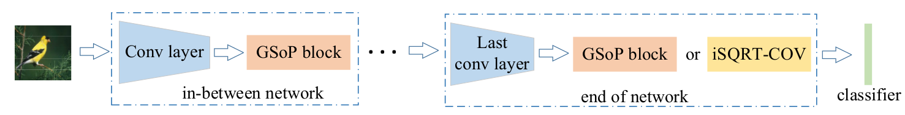
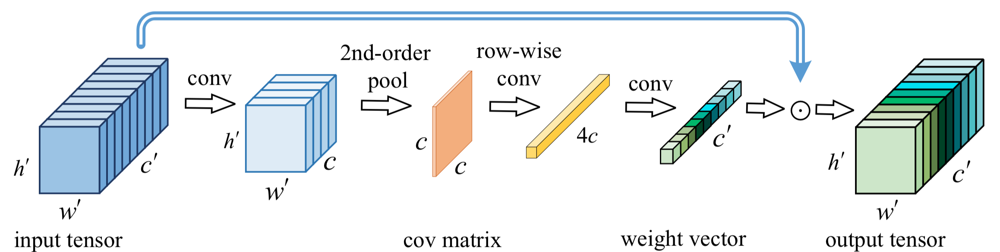

# Global-Second-order-Pooling-Convolutional-Networks
Global Second-order Pooling Convolutional Networks (CVPR2019 GSoP)

This is an implementation of GSoP Net([paper](openaccess.thecvf.com/content_CVPR_2019/papers/Gao_Global_Second-Order_Pooling_Convolutional_Networks_CVPR_2019_paper.pdf)) , created by Zilin Gao.

## Introduction

Deep Convolutional Networks (ConvNets) are fundamental to, besides large-scale visual recognition, a lot of vision tasks. As the primary goal of the ConvNets is to
characterize complex boundaries of thousands of classes in a high-dimensional space, it is critical to learn higherorder representations for enhancing non-linear modeling
capability. Recently, Global Second-order Pooling (GSoP), plugged at the end of networks, has attracted increasing attentions,
achieving much better performance than classical, first-order networks in a variety of vision tasks. However, how to effectively introduce higher-order representation in
earlier layers for improving non-linear capability of ConvNets is still an open problem. In this paper, we propose a novel network model introducing GSoP across from lower
to higher layers for exploiting holistic image information throughout a network. Given an input 3D tensor outputted by some previous convolutional layer, we perform GSoP to
obtain a covariance matrix which, after nonlinear transformation, is used for tensor scaling along channel dimension. Similarly, we can perform GSoP along spatial dimension
for tensor scaling as well. In this way, we can make full use of the second-order statistics of the holistic image throughout
a network. The proposed networks are thoroughly evaluated on large-scale ImageNet-1K, and experiments have shown that they outperform non-trivially the counterparts
while achieving state-of-the-art results.


## Citation

     @InProceedings{Gao_2019_CVPR,
                    author = {Zilin, Gao and Jiangtao, Xie and Qilong, Wang and Peihua, Li},
                    title = {Global Second-order Pooling Convolutional Networks},
                    booktitle = {The IEEE Conference on Computer Vision and Pattern Recognition (CVPR)},
                    year = {2018}
      }

## GSoP Nets



The proposed global second-order pooling (GSoP) block can be conveniently inserted after any convolutional layer in-between network. We propose to use, at the network end, GSoP block followed by common global average pooling producing compact image representations (GSoP-Net1), or matrix power normalized covariance [23] outputting covariance matrices as image representations (GSoP-Net2).

## GSoP Block


Given an input tensor, after dimension reduction, the GSoP block starts with covariance matrix computation, followed by two consecutive operations of a linear convolution and non-linear activation, producing the output tensor which is scaling (multiplication) of the input one along the channel dimension.


## Environment & Machine Configuration

- toolkit: pytorch-0.4.0

- cuda: 9.0

- GPU: GTX 1080Ti
 
- system: Ubuntu 16.04

## Start Up

You can start up the experiments by run train.sh.

```
set -e
arch=resnet50 #resnet101
GSoP_mode=1 #2  #GSoP-Net1: mode1; GSoP-Net2: mode2
batchsize=384
attdim=128
modeldir=ImageNet1k-$arch-GSoP$GSoP_mode
dataset=/put/your/dataset/path/here

if [ ! -e $modeldir/*.pth.tar ]; then

if [ ! -d  "$modeldir" ]; then
   
mkdir $modeldir

fi
cp train.sh $modeldir

python main.py -a $arch\
               -p 100\
               -j 8\
               -b $batchsize\
               --attpos $attpos\
               --GSoP_mode $GSoP_mode\
               --attdim $attdim\
               --modeldir $modeldir\
               $dataset
else
checkpointfile=$(ls -rt $modeldir/*.pth.tar | tail -1)

python main.py -a $arch\
               -p 100\
               -j 8\
               -b $batchsize\
               --attpos $attpos\
               --GSoP_mode $GSoP_mode\
               --attdim $attdim\
               --modeldir $modeldir\
               --resume $checkpointfile\
               $dataset

fi
```
## GSoP code components

```
├── main.py #main function
├── train.sh #script file
├── torchvision
│   ├── models
│   │   ├── __init__.py
│   │   ├── resnet.py  #resnet models 
│   │   ├── ....
│   │   └── ...
│   ├── ....
│   └── ....
└── torchviz
        └── ...
```

## Experiments

### ImageNet-1K

  |ResNet-50   | top-1 error (%) | top-5 error (%) |
  |:----------:|:-----------:|:-----------:|
  |GSoP-Net1   |     22.02   |    5.88     |
  |GSoP-Net2   |     21.19   |    5.64     | 
  
  
### CIFAR-100

  |ResNet-164  | top-1 error (%) |
  |:----------:|:---------------:|
  |GSoP-Net1   |        20.86    |
  |GSoP-Net2   |        18.58    |
  

## Acknowledgments

* We thank the works as well as the accompanying  code  of [MPN-COV](https://github.com/jiangtaoxie/MPN-COV) and its fast version [iSQRT-COV](https://github.com/jiangtaoxie/fast-MPN-COV). 
* We would like to thank Facebook Inc. for developing pytorch toolbox.

## Contact Information

If you have any suggestion or question, you can leave a message here or contact us directly: gzl@mail.dlut.edu.cn . Thanks for your attention!
